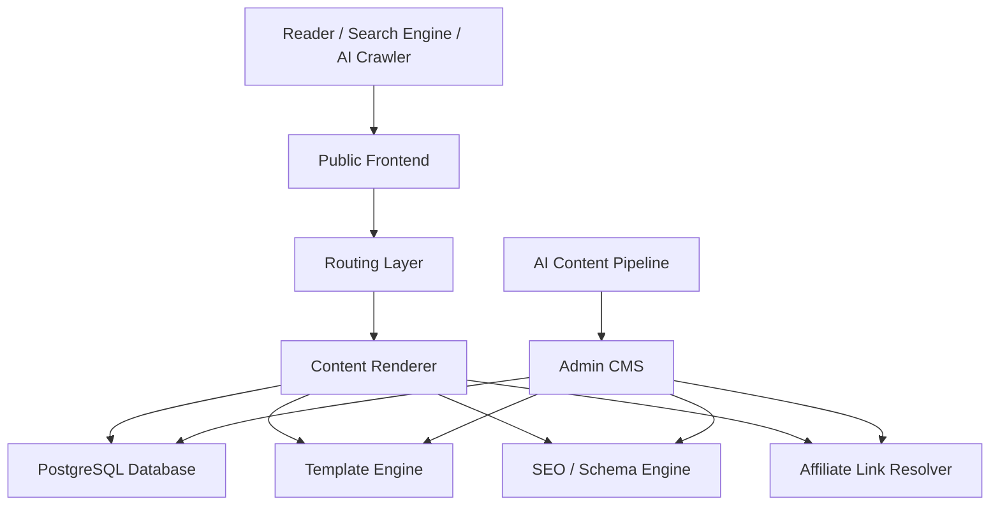

# Kiến Trúc Hệ Thống

## Trạng thái production hiện tại — 2026-09-15

MarketGB hiện chạy Next.js Node runtime và PostgreSQL 16 trên Vultr VPS; Caddy
đứng trước ứng dụng và Cloudflare tiếp tục proxy DNS/CDN. Media được lưu trên
filesystem dùng chung ngoài từng release. Các phần Cloudflare-first/VPS tương lai
bên dưới là lịch sử quyết định kiến trúc ban đầu; trạng thái vận hành mới nhất
nằm trong [CODEX_HANDOFF.md](CODEX_HANDOFF.md).

Broker Manager hiện quản lý hồ sơ/contact/headquarters, priority, sourced facts
và review score tùy chọn. Production có bộ 36 broker draft để editor cập nhật.
Trang frontend của broker vẫn là `ContentItem` loại `BROKER_REVIEW`, không được
tự sinh từ Broker record; cột `Frontend` trong admin chỉ link tới review đã
publish. Broker Review v1 source thêm market-scoped `BrokerReviewAssessment`;
ContentItem vẫn sở hữu verdict/prose/FAQ, BrokerFact vẫn sở hữu cited fact, và
AffiliateLink vẫn sở hữu offer. Chi tiết tại [BROKER_MANAGER.md](BROKER_MANAGER.md)
và `openspec/changes/031-broker-review-v1/`.

## Khuyến nghị stack

Stack đề xuất cho dự án:

- Frontend + Backend: Next.js App Router
- Language: TypeScript
- Database: PostgreSQL
- ORM: Prisma hoặc Drizzle
- CMS admin: custom admin trong cùng codebase
- Styling: Tailwind CSS + component system nội bộ
- Search nội bộ: PostgreSQL full-text giai đoạn đầu, Meilisearch/Typesense giai đoạn sau
- Cache/CDN: Cloudflare
- Hosting: Vercel, Cloudflare Pages/Workers, hoặc VPS tùy ngân sách
- Media storage: S3-compatible adapter, ban đầu có thể dùng Cloudflare R2, sau này có thể chuyển sang MinIO/S3-compatible storage trên VPS hoặc nhà cung cấp khác

Lý do chọn Next.js:

- Hợp SEO tốt qua server rendering/static generation.
- Dễ tạo route động có cấu trúc.
- Có thể làm frontend và backend trong cùng repo.
- Phù hợp website nội dung lớn.
- Dễ sinh sitemap, schema, canonical, hreflang.

## Chiến lược deploy và portability

Phương án đã thống nhất:

- Source code lưu trên GitHub.
- Giai đoạn đầu có thể connect GitHub với Cloudflare để deploy.
- Cloudflare có thể dùng cho CDN, DNS, cache, bảo mật, deploy frontend/backend và lưu media qua R2.
- Core CMS không phụ thuộc cứng vào Cloudflare.
- Database chính ưu tiên PostgreSQL thay vì Cloudflare D1 để sau này chuyển sang VPS Linux dễ hơn.
- Media/image lưu qua S3-compatible adapter thay vì gọi trực tiếp Cloudflare R2 rải rác trong code.
- Tương lai có thể chuyển sang VPS Linux riêng bằng cách deploy lại app, restore PostgreSQL, chuyển media nếu cần, và đổi biến môi trường.

Mục tiêu của chiến lược này là tránh vendor lock-in. Cloudflare được dùng như hạ tầng triển khai ban đầu, không phải nền tảng mà toàn bộ logic CMS bị khóa chặt vào.

### Cloudflare giai đoạn đầu

Các thành phần Cloudflare phù hợp:

- DNS/CDN.
- WAF/bảo mật cơ bản.
- Cache static asset.
- Pages/Workers để deploy nếu tương thích với runtime của app.
- R2 để lưu media/image.

Không nên dùng Cloudflare D1 làm database chính cho CMS này, trừ khi chỉ làm prototype rất nhỏ. D1 có thể export/import, nhưng vì D1 là SQLite serverless, việc chuyển sang PostgreSQL trên VPS sẽ phức tạp hơn so với dùng PostgreSQL ngay từ đầu.

### VPS Linux tương lai

VPS Linux có thể chạy:

- Ubuntu hoặc Debian.
- Node.js runtime.
- PostgreSQL.
- Nginx reverse proxy.
- Docker hoặc PM2.
- MinIO nếu muốn tự host object storage tương thích S3.

Khi chuyển từ Cloudflare sang VPS:

1. Deploy source code từ GitHub lên VPS.
2. Restore PostgreSQL database.
3. Copy media từ Cloudflare R2 sang MinIO/S3-compatible storage khác nếu muốn.
4. Đổi environment variables: database URL, storage endpoint, CDN URL, secrets.
5. Giữ nguyên domain và URL public để bảo toàn SEO.

## Cấu trúc tổng thể



## Các module chính

### Public frontend

Public frontend render các trang người dùng nhìn thấy:

- Trang chủ.
- Country hub.
- Language hub.
- Broker review.
- Broker comparison.
- Educational article.
- Guide/tutorial.
- Category/topic page.
- Author page.
- Legal/disclaimer pages.

Frontend không nên tự biết affiliate URL cuối cùng. Khi cần hiển thị nút CTA, frontend gọi affiliate resolver theo broker, country, language và campaign.

### Admin CMS

Admin CMS cần có các khu vực:

- Content Manager: quản lý article/page.
- Broker Manager: quản lý identity, contact, headquarters, priority, sourced
  facts và điểm review; hỗ trợ mở linked broker review đã publish từ danh sách.
- Affiliate Manager: quản lý link, campaign, tracking.
- Template Manager: quản lý loại giao diện.
- URL Manager: quản lý định tuyến và slug.
- SEO Manager: metadata, schema, index status, canonical, hreflang.
- Internal Link Manager: rule tự động và gợi ý link.
- Media Manager: ảnh, logo broker, screenshot, chart.
- Import Manager: nhận nội dung AI bằng Markdown, HTML, CSV hoặc JSON.

### Content model

Nội dung nên tách thành các entity thay vì chỉ có một bảng `posts`.

Các entity cốt lõi:

- SiteLocale: ngôn ngữ và quốc gia.
- ContentItem: bài viết/page chính.
- ContentRevision: lịch sử phiên bản.
- Topic: topic cluster.
- Category: taxonomy.
- Broker: thông tin sàn.
- BrokerFact: dữ liệu có cấu trúc về broker.
- AffiliateLink: link affiliate tập trung.
- Template: layout/template.
- UrlPattern: định nghĩa URL.
- InternalLinkRule: luật internal link.
- SeoMetadata: title, description, robots, canonical, schema.

## Cấu trúc URL đề xuất

Không dùng toàn bộ bài viết ở root như:

```text
example.com/best-forex-brokers
```

Nên dùng URL phân tầng:

```text
example.com/global/forex-brokers/best-forex-brokers/
example.com/global/forex-guides/how-to-open-forex-account/
example.com/us/forex-brokers/best-forex-brokers-in-usa/
example.com/uk/forex-brokers/best-forex-brokers-uk/
example.com/th/โบรกเกอร์-forex/best-forex-brokers-thailand/
example.com/vn/san-forex/san-forex-uy-tin/
```

Pattern đề xuất:

```text
/{market}/{content-type}/{slug}/
/{market}/{topic}/{slug}/
/{market}/brokers/{broker-slug}/
/{market}/compare/{broker-a}-vs-{broker-b}/
```

Trong đó:

- `market`: `global`, `us`, `uk`, `au`, `ca`, `in`, `th`, `vn`, ...
- `content-type`: `forex-brokers`, `forex-guides`, `forex-education`, `broker-reviews`, ...
- `slug`: slug riêng của bài.

## Affiliate link tập trung

Không đặt link affiliate trực tiếp trong HTML bài viết.

Thay vào đó, bài viết dùng token hoặc component:

```text
<AffiliateButton broker="exness" market="vn" campaign="review_top_cta" />
```

Khi render, hệ thống resolve link từ database.

AffiliateLink nên có các trường:

- brokerId
- market
- language
- campaign
- destinationUrl
- trackingParams
- status
- priority
- startDate
- endDate
- nofollow/sponsored flag

Nếu broker đổi link, chỉ cần sửa trong Affiliate Manager.

## Template system

Template không chỉ là giao diện, mà là cấu trúc nội dung + schema + component slots.

Template đề xuất:

- Article: bài giáo dục thông thường.
- Guide: hướng dẫn từng bước.
- BrokerReview: review sàn.
- BrokerComparison: so sánh nhiều sàn.
- BestBrokerList: danh sách top broker theo quốc gia.
- CountryHub: hub theo quốc gia.
- TopicHub: hub theo topic cluster.
- GlossaryTerm: giải thích thuật ngữ.
- LandingPage: trang chuyển đổi cao.

Mỗi template nên định nghĩa:

- Allowed content blocks.
- Required SEO fields.
- Required schema type.
- CTA positions.
- Internal link slots.
- Table of contents behavior.
- FAQ behavior.

## SEO/AEO/GEO engine

Mỗi bài nên có:

- SEO title.
- Meta description.
- H1 duy nhất.
- Heading structure rõ ràng.
- Table of contents.
- FAQ block.
- Summary box.
- Key takeaways.
- Broker comparison table nếu phù hợp.
- Internal links theo topic cluster.
- External source/citation fields nếu có dữ liệu factual.
- Author, reviewer, published date, updated date.
- Schema JSON-LD.
- Canonical URL.
- Hreflang cho bản ngôn ngữ/quốc gia tương ứng.

Schema cần hỗ trợ:

- Article
- FAQPage
- BreadcrumbList
- Review
- Product/FinancialProduct nếu phù hợp
- ItemList
- HowTo
- Organization
- Person

## Internal link tự động

Internal link nên dựa trên:

- Topic cluster.
- Market/country.
- Language.
- Search intent.
- Priority page.
- Anchor text dictionary.

Ví dụ:

- Bài về "how to open forex account" tự link về broker review, best broker list, risk management guide.
- Bài broker review tự link về comparison page và country-specific best broker page.
- Country hub tự link về các bài quan trọng nhất của country đó.

Không nên auto-link quá dày. Nên có giới hạn:

- 3-8 contextual links mỗi bài tùy độ dài.
- Tránh lặp cùng anchor nhiều lần.
- Tránh link sang sai market/language.

## AI content pipeline

AI có thể tạo nội dung theo format chuẩn:

- Markdown có frontmatter.
- JSON theo schema.
- HTML block có metadata.

Import pipeline nên kiểm tra:

- URL path có hợp lệ không.
- Template có đầy đủ trường bắt buộc không.
- Affiliate token có hợp lệ không.
- Broker được nhắc tới có tồn tại không.
- Internal link suggestions.
- SEO title/meta length.
- Heading structure.
- FAQ/schema.
- Duplicate slug.

## Quy mô 4.000 bài

Để vận hành 4.000 bài, cần:

- Pagination tốt trong admin.
- Search/filter nhanh.
- Bulk import.
- Bulk publish.
- Bulk metadata update.
- Sitemap chia nhỏ.
- Cache page render.
- Background job cho link scan, sitemap, schema validation.
- Content health dashboard.
